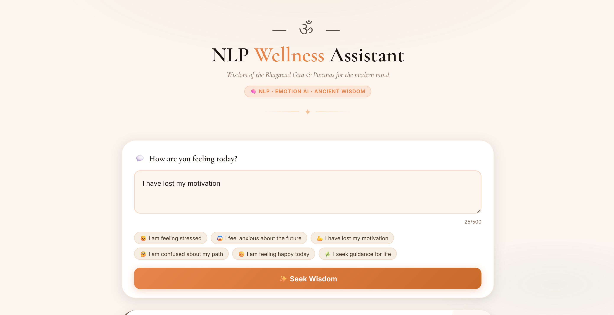
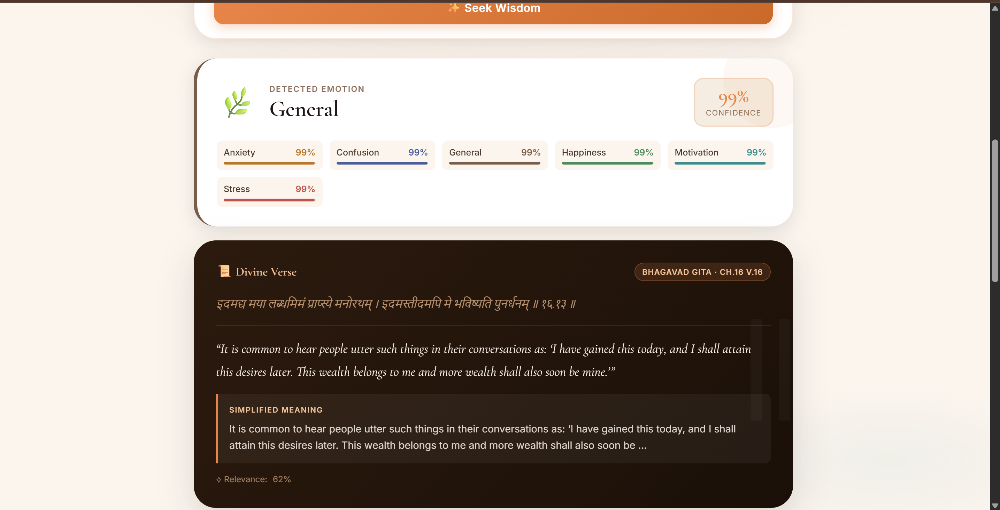
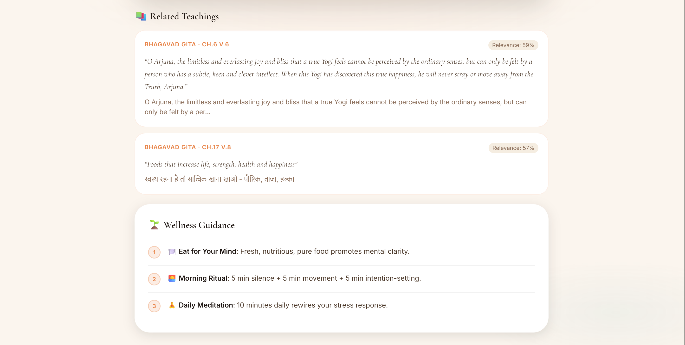

# 🕉️ NLP Wellness Assistant — Emotion Detection & Scripture Recommendation System

> AI-powered emotional wellness platform that analyzes user emotions and recommends relevant Bhagavad Gita and Hindu scripture wisdom using Natural Language Processing and Machine Learning.

🌐 **Live Demo:** https://nlp-wellness-assistant.vercel.app/

---

## 📸 Application Preview

### Home Page



### Emotion Analysis



### Wellness Recommendation



---

## 🎯 Project Overview

NLP Wellness Assistant is an NLP-powered emotional wellness application that identifies a user's emotional state from text and recommends relevant spiritual guidance from the Bhagavad Gita and Hindu scriptures.

The system combines classical Natural Language Processing, Machine Learning, and Information Retrieval techniques to provide meaningful emotional support and actionable wellness recommendations.

⚠️ This application is intended for educational and informational purposes only and should not be considered a substitute for professional mental health advice.

---

## 🚀 Features

### Intelligent Emotion Detection

* Predicts user emotions from text
* Supports 6 emotional categories
* TF-IDF Feature Engineering
* Machine Learning Classification
* Confidence-based predictions

### Scripture Recommendation Engine

* Bhagavad Gita verse retrieval
* Hindu scripture recommendations
* Context-aware matching
* Cosine Similarity ranking
* Emotion-aware relevance boosting

### Personalized Wellness Guidance

* Actionable wellness suggestions
* Emotional support recommendations
* Spiritual wisdom integration
* Explainable AI responses

---

## 📊 Dataset Information

The model was trained using emotion-labelled wellness datasets combined with scripture-based knowledge sources.

### Dataset Contains

* 6 emotion categories
* Hundreds of text samples
* Bhagavad Gita verses
* Hindu scripture references
* Wellness guidance mappings

### Supported Emotions

* Stress
* Anxiety
* Sadness
* Anger
* Fear
* Motivation

---

## 🧠 Machine Learning Pipeline

### Data Preprocessing

* Text Cleaning
* Tokenization
* Lowercasing
* Stopword Removal
* TF-IDF Vectorization

### Models Evaluated

| Model                   | Purpose     |
| ----------------------- | ----------- |
| Logistic Regression     | Baseline    |
| Multinomial Naive Bayes | Final Model |

### Selected Model

✅ Multinomial Naive Bayes

Reasons:

* Better F1 Score
* Faster Prediction
* Lightweight Deployment
* Strong Performance on Small NLP Datasets

---

## ⚙️ How It Works

### Step 1

User enters their thoughts or feelings.

### Step 2

The text is preprocessed and converted into TF-IDF features.

### Step 3

The ML model predicts the user's emotional state.

### Step 4

Relevant scripture verses are retrieved using cosine similarity.

### Step 5

The system returns personalized wellness guidance and recommendations.

---

## 🛠 Tech Stack

### Frontend

* HTML5
* CSS3
* JavaScript
* Responsive UI

### Backend

* Flask
* REST API

### Machine Learning

* Python
* Scikit-Learn
* TF-IDF Vectorizer
* Multinomial Naive Bayes
* Cosine Similarity
* Pandas
* NumPy

### Deployment

* Vercel

---

## 🔌 API Endpoint

### Predict Emotion

```http
POST /predict
```

### Request

```json
{
  "text": "I am feeling stressed about my future"
}
```

### Response

```json
{
  "emotion": "Stress",
  "confidence": 86.2,
  "verse": {
    "source": "Bhagavad Gita",
    "chapter": 2,
    "verse": 47
  },
  "guidance": [
    "Focus on actions rather than outcomes",
    "Break large goals into smaller steps",
    "Practice mindfulness"
  ]
}
```

---

## 📈 Model Performance

| Model               | Accuracy | F1 Score |
| ------------------- | -------- | -------- |
| Logistic Regression | 58.1%    | 58.9%    |
| Naive Bayes         | 67.7%    | 67.6%    |

### Final Model

✅ Multinomial Naive Bayes

---

## 📊 Generated Analytics

* Emotion Distribution
* Model Comparison
* Confusion Matrix
* Word Frequency Analysis
* Word Cloud Visualization
* Performance Metrics Dashboard

---

## 📁 Project Highlights

✅ Emotion Classification System

✅ Scripture Recommendation Engine

✅ TF-IDF Based NLP Pipeline

✅ Machine Learning Model Training

✅ REST API Architecture

✅ Explainable AI Responses

✅ Personalized Wellness Guidance

✅ Cloud Deployment

---

## 🎓 Skills Demonstrated

* Natural Language Processing
* Text Classification
* Machine Learning
* Information Retrieval
* Feature Engineering
* Flask API Development
* Model Evaluation
* Deployment & MLOps

---

## 👨‍💻 Author

### Ritik Raushan

Data Analyst | Data Scientist | Machine Learning Engineer | AI Developer

* Python
* Machine Learning
* NLP
* Data Analytics
* Generative AI
* Agentic AI

⭐ If you found this project useful, consider giving it a star.

---

### ⭐ Support This Project

If you like this project, please give it a **Star** on GitHub and share it with others.

Your support motivates future improvements and helps more people discover the project.

### 🙏 Thank You for Visiting

Built with Python, NLP, Machine Learning, and Ancient Wisdom.
